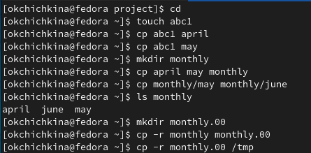
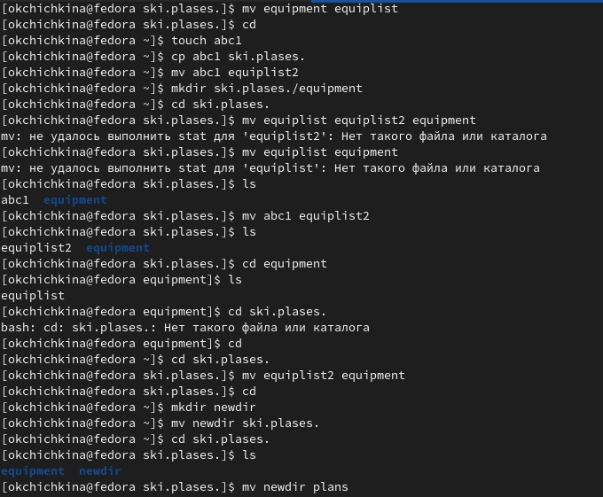
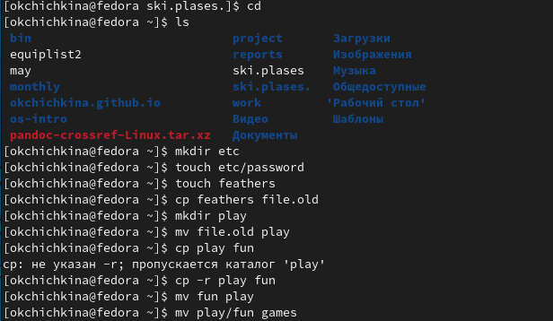
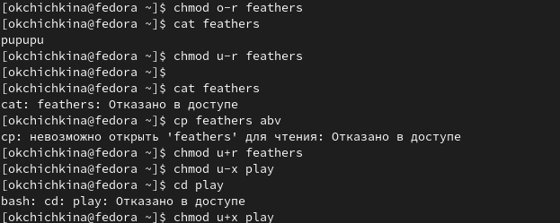
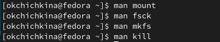

---
## Front matter
lang: ru-RU
title: "Лабораторная работа №5"
author: |
	Ольга К. Чичкина
institute: |
	\inst{1}RUDN University, Moscow, Russian Federation
date: 2022, Moscow

## Formatting
toc: false
slide_level: 2
theme: metropolis
header-includes: 
 - \metroset{progressbar=frametitle,sectionpage=progressbar,numbering=fraction}
 - '\makeatletter'
 - '\beamer@ignorenonframefalse'
 - '\makeatother'
aspectratio: 43
section-titles: true
--- 
## Цель работы

Ознакомление с файловой системой Linux, её структурой, именами и содержанием каталогов. Приобретение практических навыков по применению команд для работы с файлами и каталогами, по управлению процессами (и работами), по проверке использования диска и обслуживанию файловой системы.

# Выполнение лабораторной работы
 
 Используем на практике изученные команды
 
## Этап 1

Выполняем все примеры приведеннные в первой части  описания лабораторной работы. (рис. [-@fig:001])

{ #fig:001 width=70% }

## Этап 2

Используем на практике команды cp, mv, mkdir,touch (рис. [-@fig:002])

{ #fig:002 width=70% }

## Этап 3

Определяем опции команды chmod для файлов:
  1. drwxr--r-- ... australia
   - ответ: chmod 744
  2. drwx--x--x ... play
   - ответ: chmod 711
  3. -r-xr--r-- ... my_os
   - ответ: chmod 544
  4. -rw-rw-r-- ... feathers
   - ответ: chmod 664

## Этап 4

проделываем упражнения используя команды cp, mv, chmod, cat. (рис. [-@fig:003] [-@fig:004])

{ #fig:003 width=70% }

## Этап 4

{ #fig:004 width=70% }

## Этап 5 

Читаем man по командам mount, fsck, mkfs, kill.(рис. [-@fig:005])

{ #fig:005 width=70% }

# Выводы

ознакомилась на пратике с файловой системой Linux ее структурой, именами и содержанием каталогов. Приобрела практические навыки по применению команд для работы с файлами и каталогами, по управлению процессами (и работами), по проверке использования диска и обслуживанию файловой системы.
