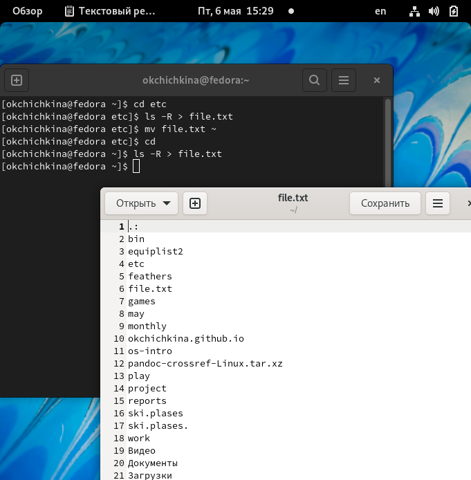
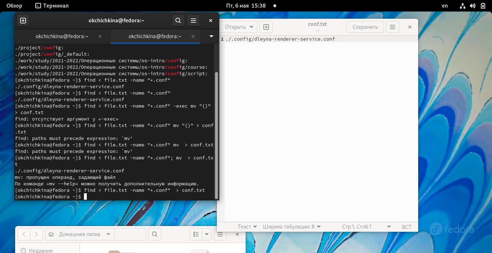
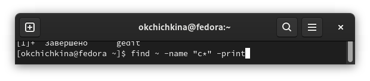
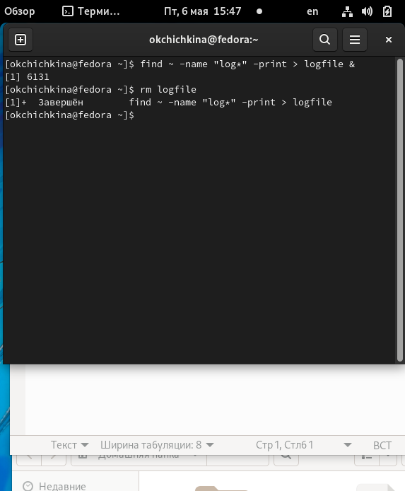
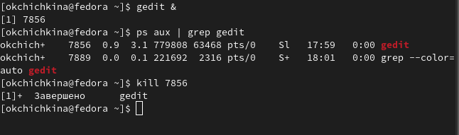
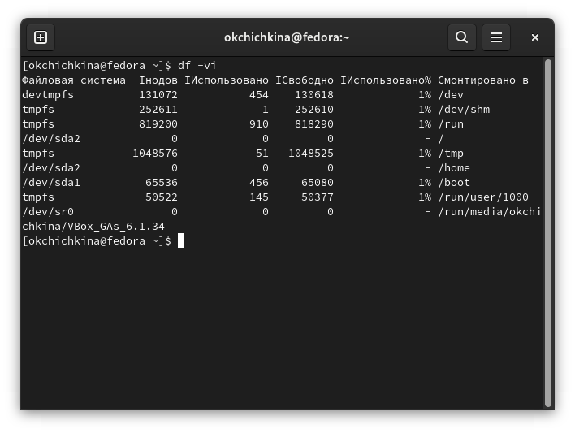
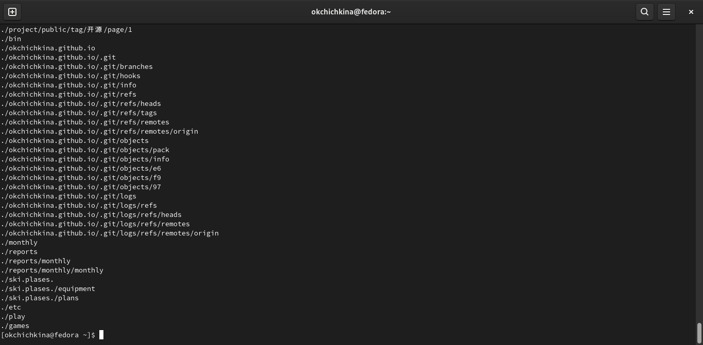

---
## Front matter
lang: ru-RU
title: "Лабораторная работа №6"
author: |
	Ольга К. Чичкина
institute: |
	\inst{1}RUDN University, Moscow, Russian Federation
date: 2022, Moscow

## Formatting
toc: false
slide_level: 2
theme: metropolis
header-includes: 
 - \metroset{progressbar=frametitle,sectionpage=progressbar,numbering=fraction}
 - '\makeatletter'
 - '\beamer@ignorenonframefalse'
 - '\makeatother'
aspectratio: 43
section-titles: true
--- 
## Цель работы

Ознакомление с инструментами поиска файлов и фильтрации текстовых данных. Приобретение практических навыков: по управлению процессами (и заданиями), по проверке использования диска и обслуживанию файловых систем.

## Выполнение лабораторной работы
 
 Используем на практике изученные команды
 
##  Этап 1
Запишите в файл file.txt названия файлов, содержащихся в каталоге /etc. Допишите в этот же файл названия файлов, содержащихся в вашем домашнем каталоге. (рис. [-@fig:001])

{ #fig:001 width=70% }

## Этап 2
Выведите имена всех файлов из file.txt, имеющих расширение .conf, после чего запишите их в новый текстовой файл conf.txt.(рис. [-@fig:002])

{ #fig:002 width=70% }

## Этап 3
Определите, какие файлы в вашем домашнем каталоге имеют имена, начинавшиеся с символа c? Предложите несколько вариантов, как это сделать.(рис. [-@fig:003])

{ #fig:003 width=70% }

## Этап 4
Запустите в фоновом режиме процесс, который будет записывать в файл ~/logfile файлы, имена которых начинаются с log. Удалите файл ~/logfile.(рис. [-@fig:004])

{ #fig:004 width=70% }

## Этап 5
Запустите из консоли в фоновом режиме редактор gedit. Определите идентификатор процесса gedit, используя команду ps, конвейер и фильтр grep. Прочтите справку (man) команды kill, после чего используйте её для завершения процесса gedit.(рис. [-@fig:005])

{ #fig:005 width=70% }

## Этап 6
Выполните команды df и du, предварительно получив более подробную информацию об этих командах, с помощью команды man.(рис. [-@fig:006])

{ #fig:006 width=70% }

## Этап 7
Воспользовавшись справкой команды find, выведите имена всех директорий, имеющихся в вашем домашнем каталоге. команда: ... find -type d ...(рис. [-@fig:007])

{ #fig:007 width=70% }
 
# Выводы

Ознакомилась с инструментами поиска файлов и фильтрации текстовых данных. Приобрела практические навыки: по управлению процессами (и заданиями), по проверке использования диска и обслуживанию файловых систем.

