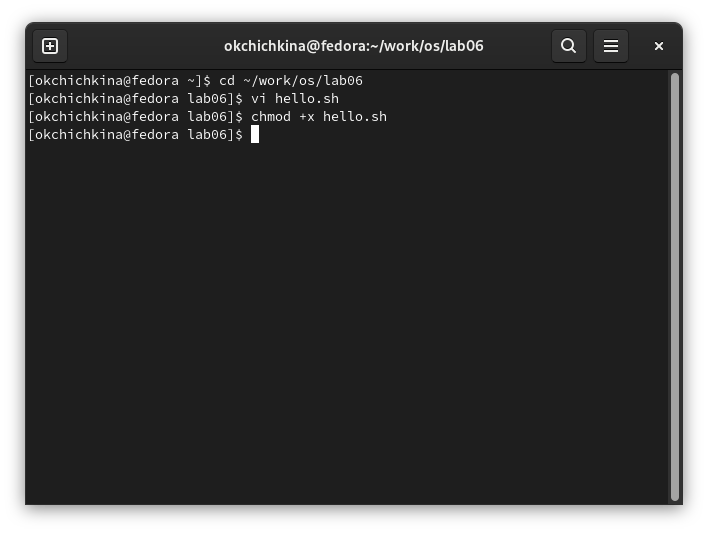
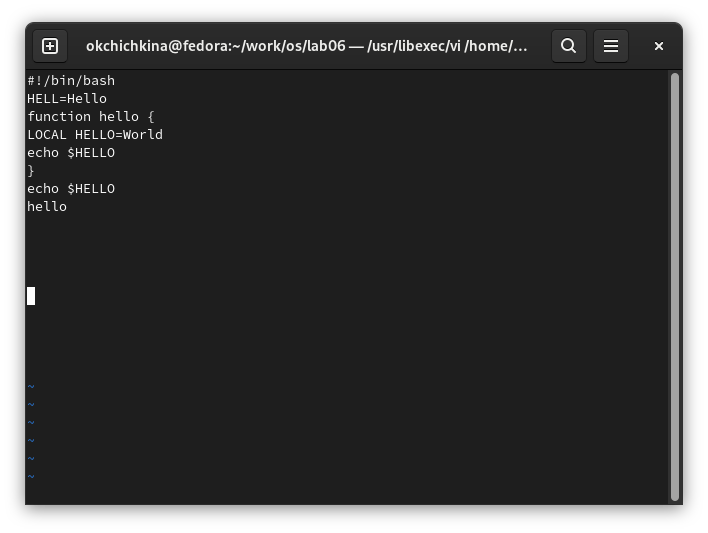
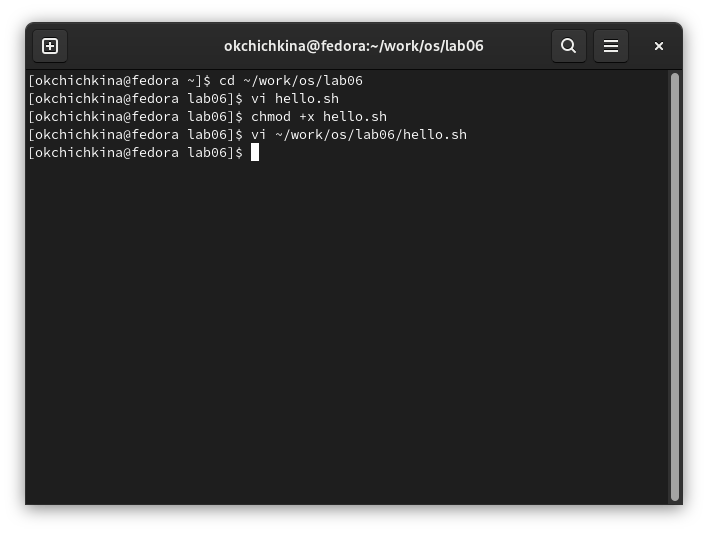
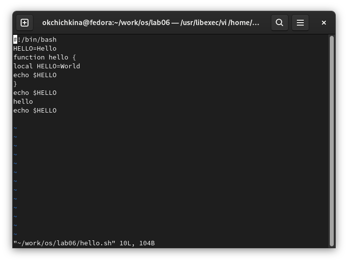

---
## Front matter
lang: ru-RU
title: "Лабораторная работа №8"
author: |
	Ольга К. Чичкина
institute: |
	\inst{1}RUDN University, Moscow, Russian Federation
date: 2022, Moscow

## Formatting
toc: false
slide_level: 2
theme: metropolis
header-includes: 
 - \metroset{progressbar=frametitle,sectionpage=progressbar,numbering=fraction}
 - '\makeatletter'
 - '\beamer@ignorenonframefalse'
 - '\makeatother'
aspectratio: 43
section-titles: true
--- 
## Цель работы

Познакомиться с операционной системой Linux. Получить практические навыки работы с редактором vi, установленным по умолчанию практически во всех дистрибутивах.

## Задания к лабораторной

1. Ознакомиться с теоретическим материалом.
2. Ознакомиться с редактором vi.
3. Выполнить упражнения, используя команды vi.

# Выполнение лабораторной работы

Задание 1. Создание нового файла с использованием vi :
 1. создаем каталог ~/work/os/lab06 и файл  hello.sh.(рис. [-@fig:001])

{ #fig:001 width=70% }

## Выполнение лабораторной работы

2. Вводим текст из лабортаорной работы в файл hello.sh(рис. [-@fig:002])

{ #fig:002 width=70% }

## Выполнение лабораторной работы

Задание 2. Редактирование существующего файла.

 1. вызываем vi на редактирование файла (рис. [-@fig:003])

{ #fig:003 width=70% }

## Выполнение лабораторной работы

2. редактируем файл используя команды вставки, удаления и отмены последней команды.(рис. [-@fig:004])

{ #fig:004 width=70% }

# Выводы

Познакомилась с операционной системой Linux. Получила практические навыки работы с редактором vi.
