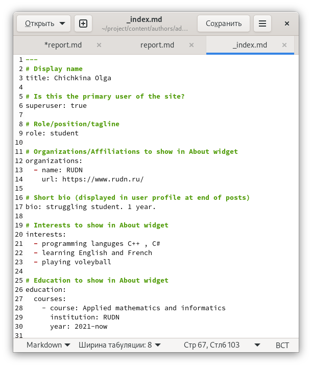
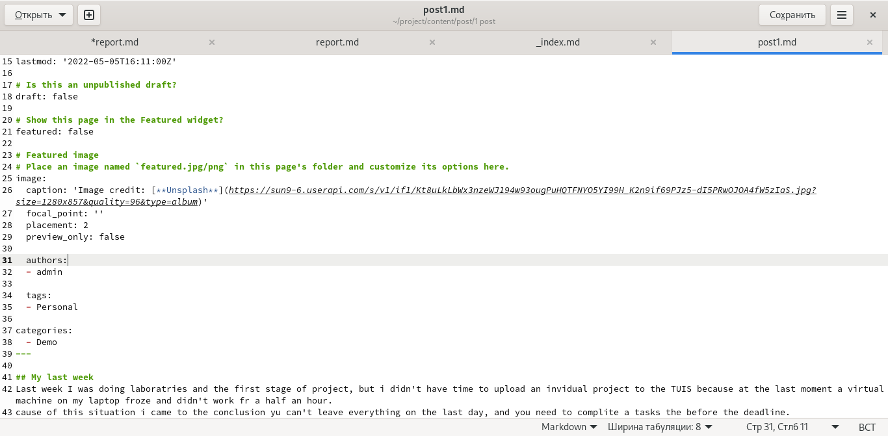
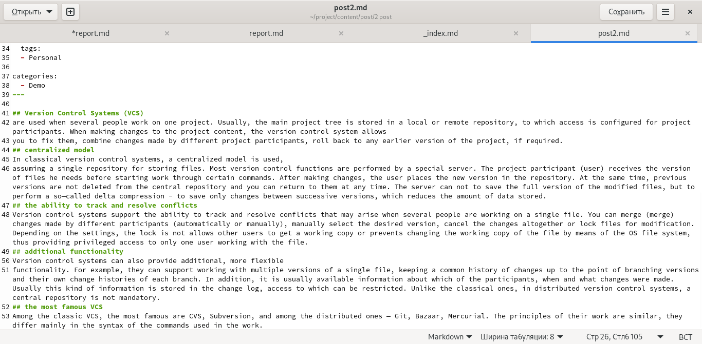
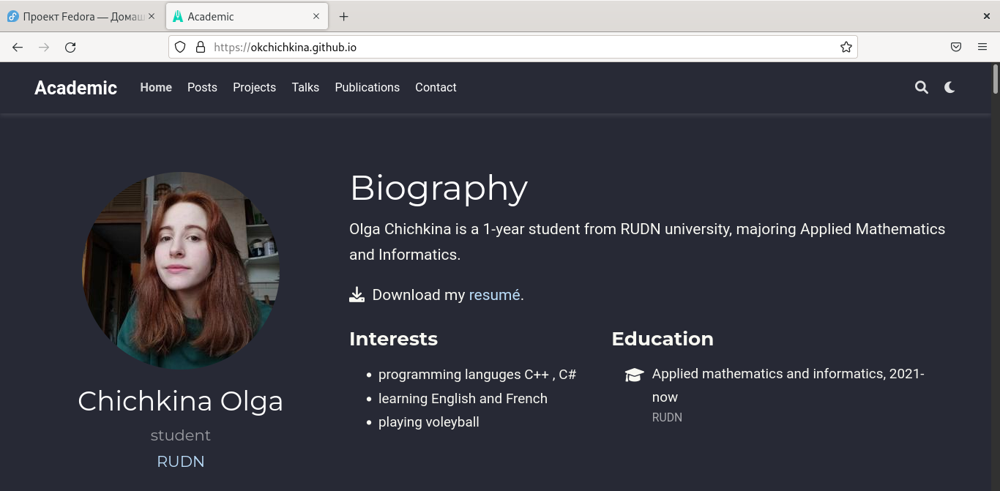

---
## Front matter
lang: ru-RU
title: "индивидуальный проект этап 2"
author: |
	Ольга К. Чичкина
institute: |
	\inst{1}RUDN University, Moscow, Russian Federation
date: 2022, Moscow

## Formatting
toc: false
slide_level: 2
theme: metropolis
header-includes: 
 - \metroset{progressbar=frametitle,sectionpage=progressbar,numbering=fraction}
 - '\makeatletter'
 - '\beamer@ignorenonframefalse'
 - '\makeatother'
aspectratio: 43
section-titles: true
--- 

## Цель 2 этапа проекта

Добавить к сайту данные о себе.

# Выполнение 2 этапа проекта

Список добавляемых данных:
 - Разместить фотографию владельца сайта.
 - Разместить краткое описание владельца сайта (Biography).
 - Добавить информацию об интересах (Interests).
 - Добавить информацию от образовании (Education).(рис. [-@fig:001])

{ #fig:001 width=70% }

## Выполнение 2 этапа проекта

Сделать пост по прошедшей неделе.(рис. [-@fig:002])

{ #fig:002 width=70% }

## Выполнение 2 этапа проекта

Добавить пост на тему управление версиями. Git.(рис. [-@fig:003])

{ #fig:003 width=70% }

## Выполнение 2 этапа проекта

главная страница после добавления информации(рис. [-@fig:004])

{ #fig:004 width=70% }
 
# Вывод

Добавила к сайту данные о себе и выложила два поста.

