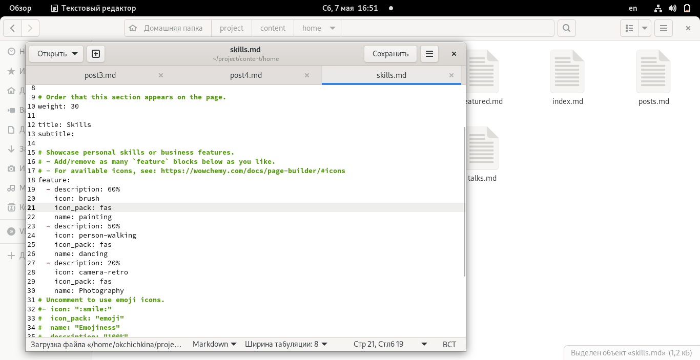
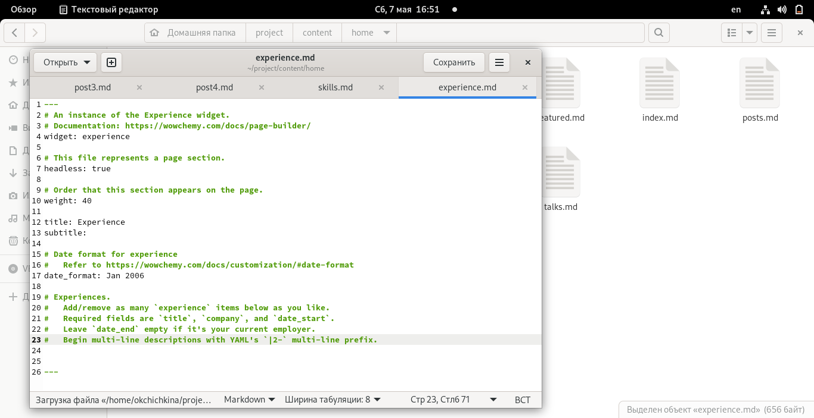
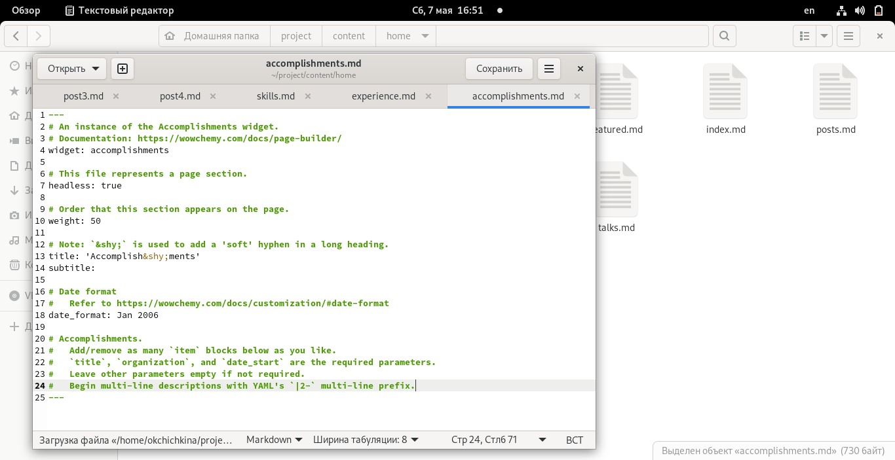
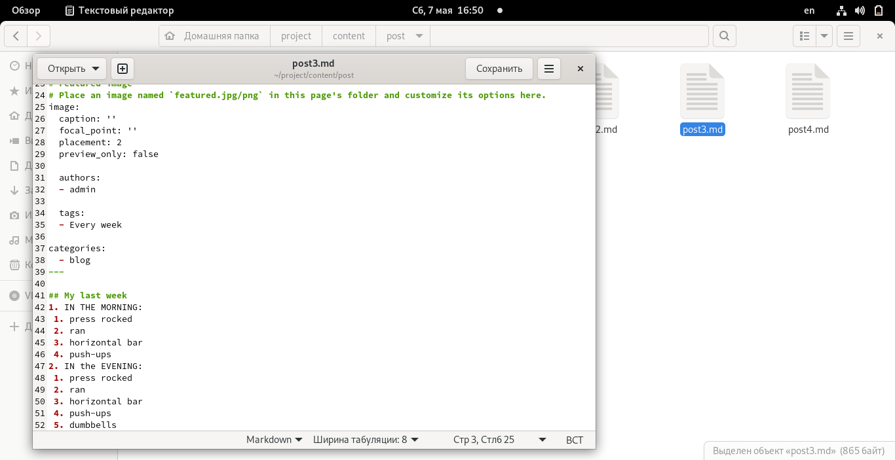
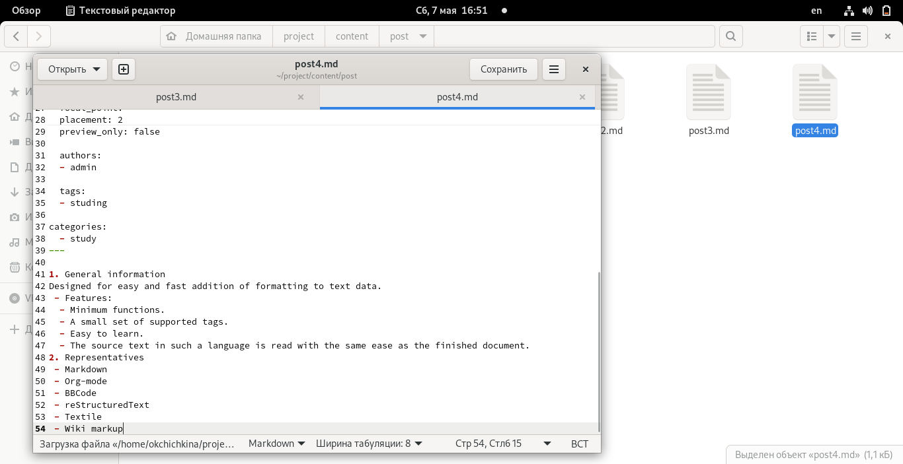

---
## Front matter
lang: ru-RU
title: "Индивидуальный проект этап 3"
author: |
	Ольга К. Чичкина
institute: |
	\inst{1}RUDN University, Moscow, Russian Federation
date: 2022, Moscow

## Formatting
toc: false
slide_level: 2
theme: metropolis
header-includes: 
 - \metroset{progressbar=frametitle,sectionpage=progressbar,numbering=fraction}
 - '\makeatletter'
 - '\beamer@ignorenonframefalse'
 - '\makeatother'
aspectratio: 43
section-titles: true
--- 
# Цель работы

Добавление к сайту достижений

# Выполнение этапа проекта

- Добавляем информацию о навыках (Skills).(рис. [-@fig:001])

{ #fig:001 width=70% }

## Выполнение этапа проекта

- Добавляем информацию об опыте (Experience).(рис. [-@fig:002])

{ #fig:002 width=70% }

## Выполнение этапа проекта

- Добавляем информацию о достижениях (Accomplishments). (рис. [-@fig:003])

{ #fig:003 width=70% }

## Выполнение этапа проекта

- Делаем пост по прошедшедшей неделе(рис. [-@fig:004])

{ #fig:004 width=70% }

## Выполнение этапа проекта

- Делаем пост на тему Легковестные языки разметки (рис. [-@fig:005])

{ #fig:005 width=70% }

# Выводы

мы добавили достижения к нашему сайту и выложили два новых поста
